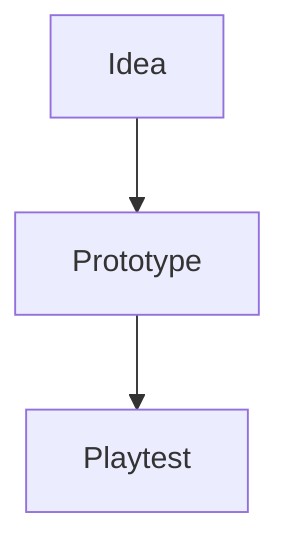

# marcus1337.github.io

Astro builds the blog at `/blog/` from Markdown or MDX. The original homepage
at `/` and Games & Projects page at `/about/` remain plain HTML. Their original
files are preserved byte-for-byte in `public/index.html` and
`public/about/index.html`; Astro copies them into the finished site unchanged.
Edit those public files directly when you want to change either page.

## Local development

Use Node.js 24 (the version used in CI) and a full Git clone. The package's
minimum Node version is 22.12.0.

```sh
npm ci
npm run dev
```

Open the local URL printed by Astro, normally `http://localhost:4321`.
The blog opens in a dark notebook theme. Use the footer's Light mode / Dark mode
button to switch; the choice is saved locally. Blog pages use one contextual
back link: Main site on the list, All posts on an article.

```sh
npm run check       # Astro, TypeScript and content-schema checks
npm test           # Git-history and new-post regression tests
npm run history    # Check committed history for every Markdown/MDX source
npm run build      # Generate the static site in dist/
npm run test:build # Check rendered pages, links, assets and preserved features
npm run preview    # Serve the production build locally
```

Commit `package-lock.json` whenever dependencies change. `npm ci` installs the
locked versions. Build output, dependencies and Astro caches are ignored by Git.

## Create a post

```sh
npm run new-post -- "My new post"
```

The command creates `src/content/blog/my-new-post.md`, prints its path and
refuses to overwrite an existing Markdown or MDX entry with the same slug.
It creates the title and explicit publication date; the body is yours to write.
Dates default to the current day in Europe/Stockholm. Optional flags are:

```sh
npm run new-post -- "A draft idea" --draft
npm run new-post -- "A richer experiment" --mdx --draft
npm run new-post -- "An earlier experiment" --date 2026-10-04
```

A minimal post is:

```yaml
---
title: "My new post"
pubDate: 2026-10-08
---
```

The collection also accepts optional `description`, `updatedDate`, `tags`,
`draft`, and `mermaid` fields. A description appears in the post list and page
metadata. Tags are a YAML list, such as `tags: [cpp, games]`.

Set `draft: true` to exclude an entry from public pages, the blog index and RSS.
Remove that field, or set it to `false`, when ready to publish. The migrated
`example-post.md` remains a draft.

Review the post, commit it and push to `main` to publish through GitHub Actions.
A post's URL combines its publication date and content filename, for example
`/blog/2026-10-08-my-new-post/`. Keep those values stable to preserve a published URL.

## Markdown and images

Ordinary `.md` posts support headings, links, lists, checklists, tables,
blockquotes, footnotes and fenced code blocks. Astro's Shiki highlighting
supports language labels such as `cpp`, `sh`, `python`, `javascript`,
`typescript`, `json` and `go`, with light and dark themes.

Small HTML elements such as `<kbd>`, `<mark>` and native expandable sections
work in Markdown. Leave a blank line before the Markdown content inside a
section:

````markdown
<details>
<summary>More detail</summary>

**Markdown** works here, including code:

```cpp
int answer = 42;
```

</details>
````

The first published post is a working reference for formatting, diagrams,
images and expandable notes.

Place public images in `public/assets/blog/` and reference their deployed path:

```markdown

```

The existing `/assets/blog/markdown-demo.svg` URL is preserved. Astro can also
process imported images from `src/` when a richer page/component needs that.

## MDX and reusable components

Use `.mdx` when an individual post needs Astro components. MDX is already
configured; no client UI framework is required. A component can be imported
relative to the post, for example:

```mdx
---
title: "A richer post"
pubDate: 2026-10-08
---

import GitDiff from '../../components/GitDiff.astro';

A small example change:

<GitDiff patch={'@@ -1 +1 @@\n-before\n+after\n'} />
```

The post layout adds metadata and real Git history automatically. Add other
reusable components under `src/components/` as a post needs them. Interactive
demos can use a component's browser script or an appropriate Astro integration.

## Mermaid diagrams

Add `mermaid: true` to frontmatter, then use a Mermaid code fence:

````markdown

````

Only enabled posts include `public/scripts/mermaid.js`. It loads Mermaid
12.1.0 from a pinned jsDelivr URL after finding diagram blocks. Rendering uses
strict security and follows the selected blog colour scheme. Each rendered diagram
keeps its original code in an expandable **Diagram source** section. If
JavaScript is disabled, the library cannot load, or a diagram is invalid,
readable source remains available. Use `accTitle` and `accDescr` to describe
diagrams for screen readers.

## Post Git history

`src/lib/post-history.mjs` reads each post's committed Git history during
Astro's static build. Each post has an expandable **Edit history** section
with dated descriptions, readable edit notes, line counts and a link to view
the edit on GitHub. A **View source changes** section shows added and removed
passages from that post. `PostHistory.astro` and `GitDiff.astro` render these
sections as native HTML; the browser does not fetch commit data.

History follows renames using Git's similarity detection. Changes belonging
to other files in the same commit are excluded. Merge patches compare against
the first parent, and binary changes display unavailable line counts.
Uncommitted edits do not appear in history. Full history is required; the
checker fails for a shallow clone. Run `git fetch --unshallow` if necessary.

The migration moved posts and updated the formatting demo. To preserve history
even when Git cannot identify a move combined with a rewrite,
`src/lib/post-history-migration.json` connects the three migrated source paths
to their old paths at an immutable pre-migration commit. The build combines
that ancestry with current history and deduplicates commits. Future posts need
no mapping or commit list in frontmatter; later recognized renames continue
to follow the existing lineage. Keep the referenced commit in the repository's
history. The old Python generator and generated Jekyll data file are removed.

`npm run history` checks this process separately and prints commit counts. The
production build generates the HTML directly without a separate JSON artifact.
Regression tests cover mixed commits, unusual filenames, renames/copies,
merges, binary files, shallow checkouts and migration ancestry.

## Structure

```text
src/
  components/          Blog navigation, head metadata, posts and edit history
  content/blog/        Markdown and MDX content, including explicit drafts
  content.config.ts   Validated content collection
  layouts/            Shared blog layouts
  lib/                Blog URLs and build-time Git history
  pages/              Blog routes and RSS
  styles/             Blog visual system and article typography
public/
  index.html          Original plain HTML homepage
  about/index.html    Original plain HTML Games & Projects page
  assets/blog/        Images with stable public URLs
  scripts/mermaid.js  Conditional diagram renderer
scripts/              New-post helper and build/history checks
tests/                Node regression tests
```

Astro provides static page generation and syntax highlighting. `@astrojs/mdx`
adds richer posts, `@astrojs/rss` creates the feed, and `@astrojs/sitemap`
generates the sitemap. `@astrojs/check` and TypeScript provide development
checks. Both former Python helpers are replaced with standard-library Node
modules. Astro components replace the blog's Jekyll templates. The standalone
homepage and About page retain their original markup, styles and scripts.

## GitHub Pages deployment

The site is the user Pages repository `marcus1337.github.io`, served at `/`.
`astro.config.mjs` sets the site URL to `https://marcus1337.github.io` and uses
static output with trailing slashes. It needs no project subdirectory base.

`.github/workflows/pages.yml` runs on pushes to `main` and manual dispatch.
It checks out full history with `fetch-depth: 0`, uses Node 24 and `npm ci`,
runs checks/tests/history validation, builds `dist/`, verifies the generated
site, uploads it and deploys it with GitHub Pages. Deployment is limited to
`main`. In repository **Settings → Pages**, keep **Source** set to
**GitHub Actions**.

The existing homepage, `/about/`, `/blog/` and all three published blog URLs
are preserved; redirects are unnecessary. RSS is available at `/rss.xml` and
the sitemap at `/sitemap-index.xml`. Blog titles, descriptions, canonical URLs,
Open Graph/social metadata and the favicon come from shared head metadata.
