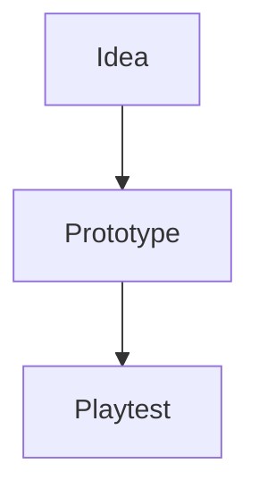

# marcus1337.github.io
website

## Write a blog post

From the repository root:

```sh
python3 scripts/new-post.py "My first post"
```

Open the printed `_posts/YYYY-MM-DD-my-first-post.md` file and replace
`Write your post here.` with your text. Keep the three-line title block
at the top. Headings, links, images, and fenced code blocks use Markdown.
An optional `description: "A short summary"` line in the title block
adds a summary to the blog list.

Then review and publish:

```sh
git add _posts/
git commit -m "Add blog post"
git push
```

The Pages workflow builds the blog automatically after a push to `main`. Posts appear at
`https://marcus1337.github.io/blog/`, newest first.
Each post URL includes its date, so posts with the same title on different
days have separate pages.

`_drafts/example-post.md` is an unpublished formatting example.
To keep a post unpublished, keep its file in `_drafts/`; move it to
`_posts/` with a `YYYY-MM-DD-` filename prefix when ready. Images can
be placed in `assets/blog/` and linked as
``.

The first post, `_posts/2026-10-04-my-first-post-thanks-chatgpt.md`, is a
working formatting demo: code, tables, lists, images, quotes, footnotes,
expandable notes and diagrams. Copy examples from it into new posts.

### Mermaid diagrams

Add `mermaid: true` below `title:` in the post's opening YAML block, then
write a fenced diagram:

````markdown

````

The browser loads Mermaid 12.1.0 from jsDelivr only on enabled posts.
Diagrams follow the system colour scheme and have an expandable source.
If the library cannot load or a diagram has invalid syntax, its source
remains readable. Use `accTitle:` and `accDescr:` in a diagram to describe
it for screen readers; the demo includes examples.

### Post history

Each published post has an expandable **Post history** list in place of
the bottom **← All posts** link. The header's **Blog** link remains
available for navigation. Entries show
the commit SHA, committer date, full message, additions/deletions, file
path and the diff for that post only. The GitHub link opens the full
commit, which may contain other files.

The build runs `scripts/post-history.py` before Jekyll. It reads committed
Git history and generates `_data/post_history.json`, indexed by the
current post's source path. The post layout renders this data as native
HTML `<details>` elements; no browser requests or JavaScript are needed.
Generated history is ignored by Git and refreshed on every build.
Future posts need no extra front matter or manual commit list.

The checkout uses `fetch-depth: 0` so earlier commits are available.
History follows renames using Git's similarity heuristics, just like
`git log --follow`; a rename combined with a large rewrite may not be
recognized. For a merge commit, displayed changes are compared with its
first parent and labelled with that parent. The initial version is
compared with an empty file. Binary changes have no line counts.
Only committed changes are listed; edits in the working tree are not
included in history.

To regenerate history for a local Jekyll build, run from the repository
root:

```sh
python3 scripts/post-history.py --repository marcus1337/marcus1337.github.io
```

The generator requires Git, Python 3 and a full clone. It uses only the
Python standard library. Its regression tests run with:

```sh
python3 -m unittest discover -s tests
```

## First-time setup

The Blog button, list, article layout, and configuration are ready.
Review the changes, commit them, and push to enable them on the live site:

```sh
git add index.html blog/ _layouts/ _includes/ _posts/ _drafts/ assets/ scripts/ tests/ .github/ _config.yml .gitignore README.md
git commit -m "Add post history to the blog"
git push
```

In the repository's **Settings → Pages → Build and deployment**, change
**Source** from **Deploy from a branch** (`main` / repository root) to
**GitHub Actions**. This one-time change allows the history generator to
run before Jekyll; the former branch build does not run custom scripts.

`.github/workflows/pages.yml` tests and generates the history, builds with
GitHub's Pages-compatible Jekyll action, uploads `_site`, and deploys the
artifact. It runs on pushes to `main` or manually from the Actions tab.
Only `main` can deploy, and an active deployment is allowed to finish.
The deployment job has the Pages and identity-token write permissions
required by GitHub; the build job only reads repository contents.
You do not need to install Jekyll locally for writing or publishing.
