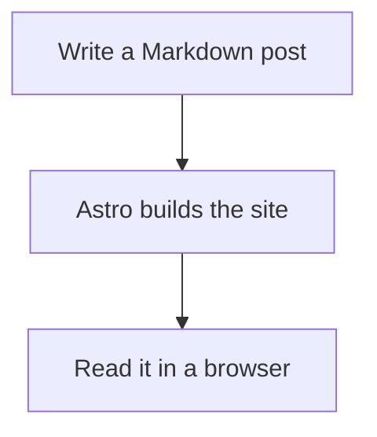
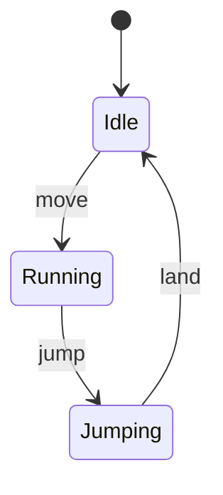
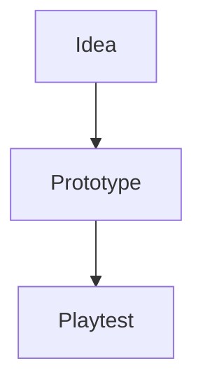

This first post is a small formatting playground. It shows what I can put in future entries about games, code and other experiments. Open the examples below to see how they are written.

## Words, links and headings

There is **bold text**, *italic text*, ~~crossed-out text~~ and inline code such as `std::vector`. Links work too: [my GitHub](https://github.com/marcus1337) or [the diagrams further down](#diagrams-from-text).

### A smaller heading

Use `##` for a section and `###` for a subsection. The post title at the top is already the main heading.

<details>
<summary>Show the Markdown</summary>

```markdown
## A section
### A subsection

**bold** · *italic* · ~~crossed out~~ · `inline code`
[A link](https://github.com/marcus1337)
```

</details>

## Lists and checklists

- A short idea
- A useful link
  - A little more detail, indented underneath

1. Make something small.
2. Try it out.
3. Write down what happened.

- [x] Set up the blog
- [x] Try some formatting
- [ ] Write the next post

<details>
<summary>Show the Markdown</summary>

```markdown
- A bullet
  - A nested bullet

1. First step
2. Next step

- [x] Finished
- [ ] Still to do
```

</details>

## Code with syntax highlighting

Put a language name after the opening three backticks. Here is a tiny C++ state example:

```cpp
enum class State { Idle, Running, Jumping };

State nextState(bool grounded, bool moving) {
    if (!grounded) return State::Jumping;
    return moving ? State::Running : State::Idle;
}
```

Shell commands work the same way:

```sh
npm run new-post -- "A small experiment"
```

<details>
<summary>Show how to write a code block</summary>

````markdown
```cpp
int main() {
    return 0;
}
```
````

Other useful language labels include `python`, `go`, `javascript`, `json` and `sh`.

</details>

## Tables

| Thing to share | A useful format |
| :--- | :--- |
| A small function | A code block |
| A comparison | A table |
| A workflow or state machine | A Mermaid diagram |
| Extra detail | An expandable section |

<details>
<summary>Show the Markdown</summary>

```markdown
| Feature | Why use it? |
| :--- | :--- |
| Code | Share a small example |
| Diagram | Explain how parts connect |
```

</details>

## Diagrams from text

Mermaid turns a fenced code block into a diagram. For example, this is how a post reaches the site:



It can also describe a simple game state machine:



Open **Diagram source** below either diagram to copy its text. In a future post, add `mermaid: true` to the title block at the top of the file, then wrap that text in a code fence labelled `mermaid`:

<details>
<summary>Show the post setting and fence format</summary>

```yaml
---
title: "A small experiment"
pubDate: 2026-10-04
mermaid: true
---
```

````text

````

Mermaid loads from a pinned CDN version on posts that enable it. If JavaScript is disabled or the library cannot load, the diagram stays readable as source text.

</details>

## Images

Images can live in the repository alongside the posts. This small example is an SVG; PNGs, JPEGs and GIFs work too.


```markdown

```

Put the file in `public/assets/blog/` and use a description between the square brackets.

## Quotes and footnotes

> A little prototype can be enough to make an idea easier to explain.

That is an example quote for this demo. A footnote can hold a small aside without interrupting the paragraph.[^demo]

<details>
<summary>Show the Markdown</summary>

```markdown
> A quoted passage or a note.

A sentence with a footnote.[^note]

[^note]: The extra information goes here.
```

</details>

## A few HTML extras

Markdown can include small pieces of HTML. For example, <kbd>Ctrl</kbd> + <kbd>F</kbd> looks like keyboard keys, and <mark>this phrase is highlighted</mark>.

<details>
<summary>Open a small extra note</summary>

This section uses native HTML, so it opens with a click, tap or keyboard. Markdown still works inside it: **bold text**, lists and code blocks.

```python
print("Hello from an expandable section!")
```

</details>

<details>
<summary>Show the HTML for these extras</summary>

```html
<kbd>Ctrl</kbd> + <kbd>F</kbd>
<mark>A highlighted phrase</mark>

<details>
<summary>A short label</summary>

Your extra explanation, with **Markdown** if you want it.

</details>
```

</details>

---

To make another entry, run `npm run new-post -- "My next post"` from the repository root and edit the file it creates. This post can stay here as a reference when I need a formatting example.

[^demo]: This is a demo footnote. Its return arrow takes you back to the sentence.
